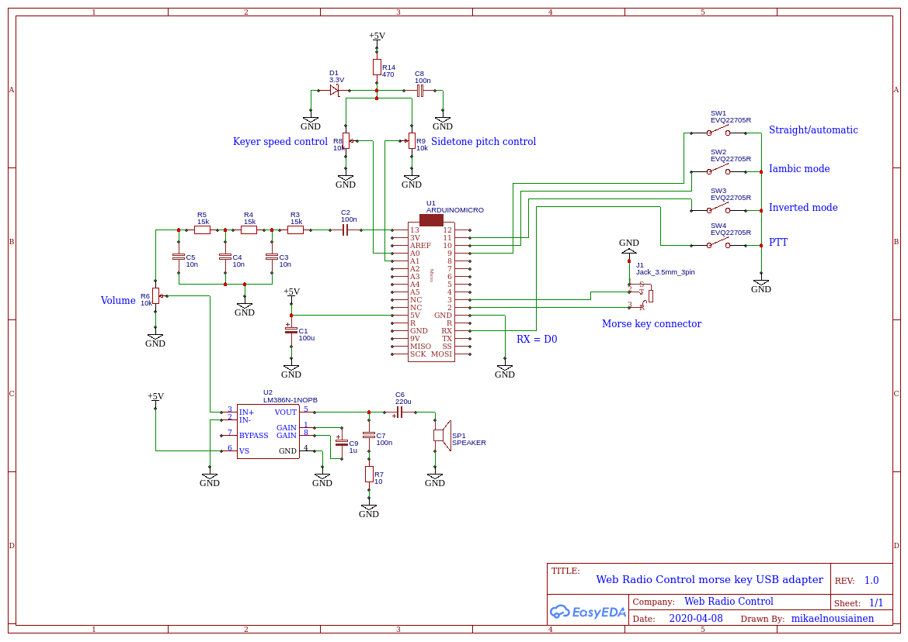

# Web Radio Control morse key and PTT adapter

This is a USB adapter for a physical morse key and a PTT switch to be used with Web Radio Control
amateur radio station remote control software. The adapter connects to a computer or a mobile device via a USB port
and represents itself as a standard keyboard. The adapter will use Web Radio Control user interface keyboard shortcuts
(in a web browser) to control PTT and to perform morse keying.

The morse key adapter supports straight keys and provides a automatic keyer for dual-lever paddles.
The keying speed is adjustable via a potentiometer. The adapter generates CW sidetone and the pitch
and the volume of the sidetone are also adjustable via potentiometers.

## Features

* Straight key support
* Integrated CW keyer for dual-lever paddle with adjustable speed
* CW sidetone generation (via audio amplifier) with adjustable pitch and volume
* Option to use Iambic mode with a dual-lever paddle
* Option to invert dual-lever paddle functions
* Support for an external PTT switch

## Hardware requirements

The default PlatformIO config and the source code settings assume use of [Arduino Micro](https://store.arduino.cc/arduino-micro)
or a compatible board that has an [ATmega32U4](https://www.microchip.com/wwwproducts/en/ATMEGA32U4) microcontroller.
This is the only microcontroller supported currently, because many Arduino models use microcontrollers that
do not provide USB client device support. Support for other microcontrollers with USB client functionality may be added later.

### Full schematic



ATmega32U4 input pin descriptions:

* D0 (RX) = PTT (active low)
* D2 = Straight key or dual-lever paddle dit (tip, active low)
* D3 = Dual-lever paddle dah (ring, active low)
* D9 = Straight/automatic (low = straight)
* D10 = Iambic mode (active high)
* D11 = Inverted dual-lever paddle functions mode (active high)
* A0 = Keyer speed control
* A1 = Keyer sidetone pitch control

ATmega32U4 output pin descriptions:

* D13 = CW sidetone output (PWM square wave) - optional

The schematic includes a simple low-pass filter for the PWM square wave
CW sidetone output, which is then passed to an LM386 audio amplifier
in order to amplify the sidetone for speaker output.

## Use of external keyers

When using this adapter in straight key mode, an external keyer, such as the
[K3NG CW Keyer](https://blog.radioartisan.com/arduino-cw-keyer/) can be connected
to this adapter to provide additional functionality.

The CW key output of an external keyer should be connected to pin D2
of the ATmega32U4 microcontroller. The incoming signal must be pull D2 pin to GND
when active. Optionally, PTT control from an external keyer can be connected
to pin D0 (active low). 

## Building the firmware

```bash
platformio run
```

## Flashing the firmware

```bash
platformio run --target upload
```

## Flashing binary only

### Windows

* Download the latest binary firmware file from `release` directory: [wrc-morse-key-adapter-20201008.hex](release/wrc-morse-key-adapter-20201008.hex).
* Install Arduino IDE for Windows to get the latest version of `avrdude.exe` that
  is a command-line application used to flash Arduino boards.
* Connect the Arduino to a USB port
* Find out the COM port for the Arduino using Device Manager in Control Panel.
  * Windows 10: Control Panel -> Hardware and Sound -> Device Manager.
  * The listing shows COM ports under: Ports (COM & LPT)
  * Look for: USB Serial Device (COMx)
* Execute the following command to reset Arduino and to switch it to mode for flashing.
  Remember to adjust the COM port in the command (COM3 in the example).
```bash
avrdude -p atmega32u4 -c arduino -P COM3 -b 1200
  ```
* Execute the following command to flash the new firmware in file `wrc-morse-key-adapter-20201008.hex`.
  You will have only 8 seconds to do this until Arduino returns back to normal mode.
  Note that the COM port changes once again, usually to a port with
  a number one higher than previously (COM4 in this example).
```
avrdude -c avr109 -p atmega32u4 -P COM4 -b 57600 -D -U flash:w:wrc-morse-key-adapter-20201008.hex
```
